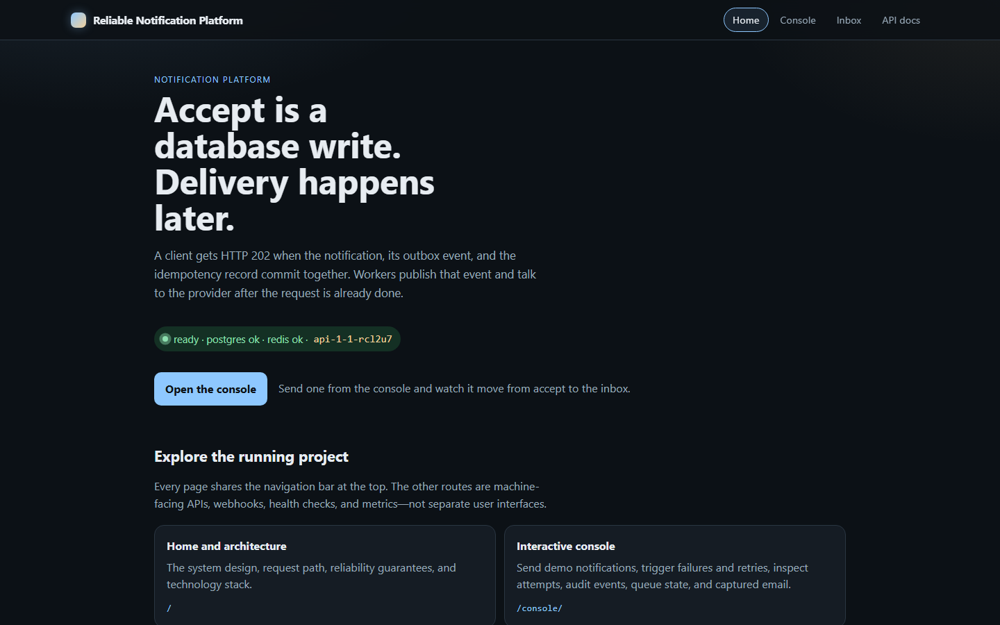
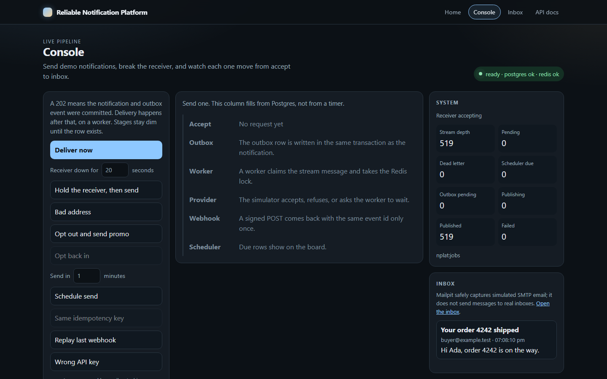
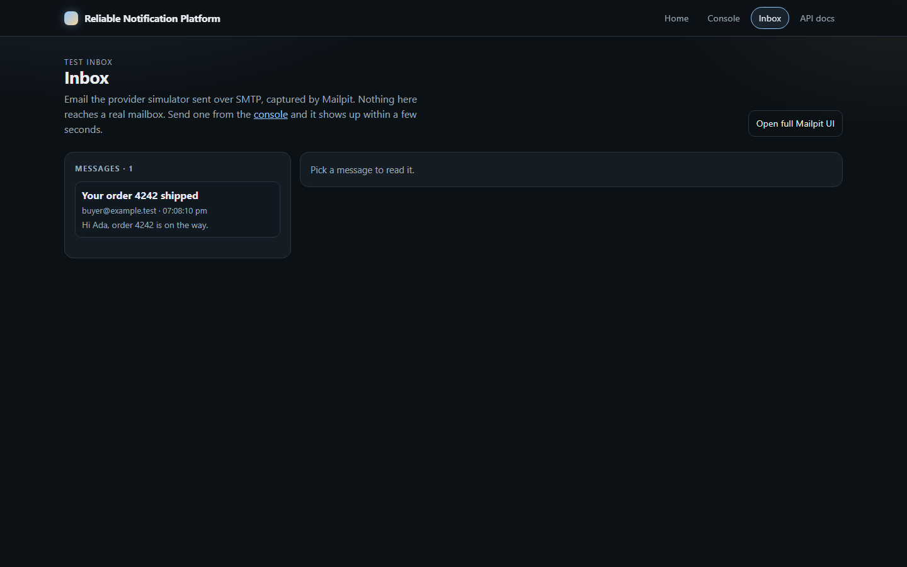
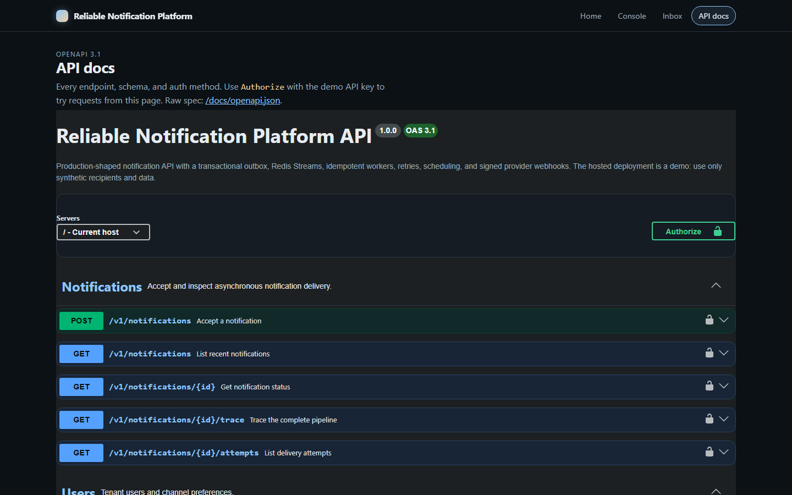
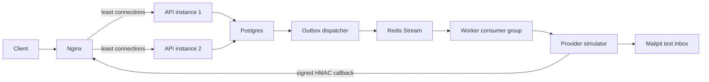

# Reliable Notification Platform

A production-shaped, multi-tenant notification backend built to make delivery reliability visible: transactional outbox, Redis Streams, stateless API replicas, idempotent workers, retries, scheduling, dead-letter handling, signed webhooks, and metrics.

**Live demo placeholder:** `https://YOUR_EC2_DOMAIN/`
Replace this only after DNS and TLS terminate at the shared edge proxy. The application itself remains deployable with the same Docker Compose overlay.

## Explore

| Page | Local URL | What is there |
|---|---|---|
| Home | http://localhost:8090/ | Animated architecture, reliability model, and stack |
| Console | http://localhost:8090/console/ | Send scenarios; inspect outbox, attempts, retries, audit, webhooks, and inbox |
| API docs | http://localhost:8090/docs/ | OpenAPI/Swagger contract and authenticated request examples |
| Inbox | http://localhost:8090/console/inbox/ | Email captured by Mailpit over SMTP; it never sends to real inboxes |
| Mailpit | http://localhost:8090/mailpit/ | The full Mailpit UI (headers, HTML, raw source), linked from the inbox |

Every page shares one navigation bar and stylesheet (`apps/web/public/site.css`), including the Swagger docs and the proxied Mailpit UI.









## Architecture



The two API containers run the **same stateless application** and share Postgres and Redis. A 202 means the notification and outbox event committed. `submitted` means the provider accepted the message. Only a signed provider webhook changes it to `delivered`; bounce/failure webhooks change it to `dead`.

Delivery is **at least once** with idempotency at acceptance, worker locking, provider submission, and webhook ingestion. It does not claim exactly-once delivery.

## Quick start

Requirements: Docker Desktop/Engine with Compose v2.

```bash
docker compose up --build -d
docker compose ps
```

Wait for both APIs to become healthy, then open http://localhost:8090/.

```bash
curl http://localhost:8090/v1/notifications \
  -H "x-api-key: nplat_live_dev_demo_key_do_not_use_in_prod" \
  -H "idempotency-key: demo-1" \
  -H "content-type: application/json" \
  -d '{"userId":"user-1","type":"order.shipped","channel":"email","payload":{"name":"Ada","orderId":"42"}}'
```

The seeded tenant key is intentionally public and only for synthetic demo data. Local admin credentials are `admin@nplat.local` / `admin-dev-password`; they are not embedded in the browser bundle and are replaced for the deployment overlay.

## Demonstrated failure cases

- Concurrent workers race on one job, but a Redis lock permits one provider submission.
- Transient failures are acknowledged and scheduled with full-jitter exponential backoff.
- Permanent failures and exhausted retries enter `nplat:jobs:dlq`.
- A repeated idempotency key returns the stored acceptance result.
- Replayed webhook event IDs return `duplicate` without applying the transition twice.
- Scheduled notifications get an outbox row only when `send_at` becomes due.
- Marketing opt-out cancels inside the acceptance transaction.

## Measured result

One recorded local run on 2026-08-18 offered 25 RPS for 20 seconds:

- 500/500 requests returned HTTP 202.
- Accept latency: p50 468.3ms, p95 1011.6ms, p99 1241.0ms.
- Worker/delivery throughput after the run: approximately 13.84 jobs/s.
- Queue depth: 513; PEL: 0; DLQ: 0.
- End-to-end p95: approximately 1.832s; provider p95: approximately 151ms.

These are laptop observations, not production capacity. See [the complete recorded result](docs/benchmark-results.md) and [measurement instructions](docs/how-to-measure.md).

## Development and CI

```bash
npm ci
npm run typecheck
npm run build
npm run build -w @nplat/web
npx vitest run tests/unit
npx vitest run tests/integration
node load-tests/run-bench.mjs
```

GitHub Actions runs backend typechecking/build, the web build, unit tests, Docker-backed Testcontainers integration tests, and local/production Compose validation.

## Demo deployment

The production overlay keeps Postgres, Redis, Mailpit SMTP, Prometheus, and Grafana off host ports. It requires unique secrets, lowers public limits, disables payload-controlled failures, exposes read-only demo statistics instead of browser admin credentials, and uses the existing external `portfolio-edge` network.

```bash
cp env.production.example .env
# Generate every secret; do not leave the example placeholders.
docker network create portfolio-edge 2>/dev/null || true
docker compose -f docker-compose.yml -f docker-compose.prod.yml up -d --build
```

Follow [the EC2/demo deployment runbook](docs/demo-deployment.md) for DNS/TLS, health checks, reset, rollback, and security-group boundaries.

## Repository layout

```text
apps/api                 Express API, OpenAPI UI, webhooks, outbox dispatcher
apps/worker              Redis Streams consumer and provider submission
apps/scheduler           scheduled sends and retry enqueueing
apps/provider-simulator  email/SMS/push behavior and signed callbacks
apps/web                 interactive console served by Nginx
packages/shared          database, queue, locks, metrics, migrations
infra                    Nginx, Prometheus, Grafana, Docker
tests                    Vitest unit tests and Testcontainers integration tests
load-tests               k6 scripts and measured benchmark runner
```

## Documentation

- [Architecture](docs/architecture.md)
- [Database schema](docs/database-schema.md)
- [Queue design](docs/queue-design.md)
- [Transactional outbox](docs/outbox.md)
- [State machine](docs/state-machine.md)
- [Retry and idempotency](docs/retry-and-idempotency.md)
- [Scheduling](docs/scheduling.md)
- [Failure modes](docs/failure-modes.md)
- [Observability](docs/observability.md)
- [Scaling](docs/scaling.md)
- [Benchmarks](docs/benchmarks.md)
- [Measured local results](docs/benchmark-results.md)
- [Testing](docs/testing.md)
- [Demo deployment](docs/demo-deployment.md)
- [Interview questions](docs/interview-questions.md)

## Scope

Email, SMS, and push vendors are simulated. Mailpit is a local SMTP catcher, not a real delivery provider. The public deployment must contain only synthetic data and should be periodically reset. A real provider adapter can be added behind environment configuration without changing the outbox/queue design.
